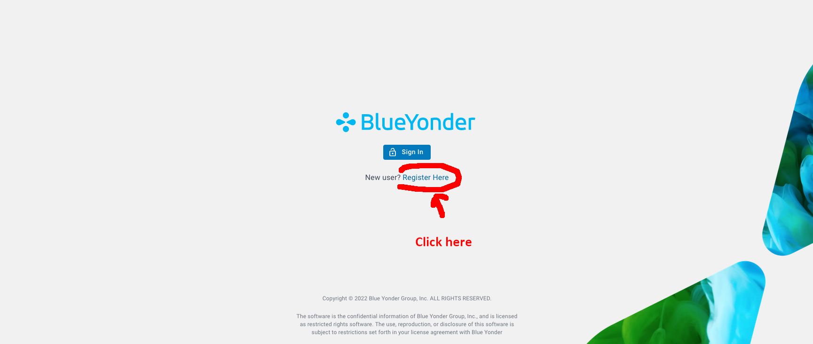
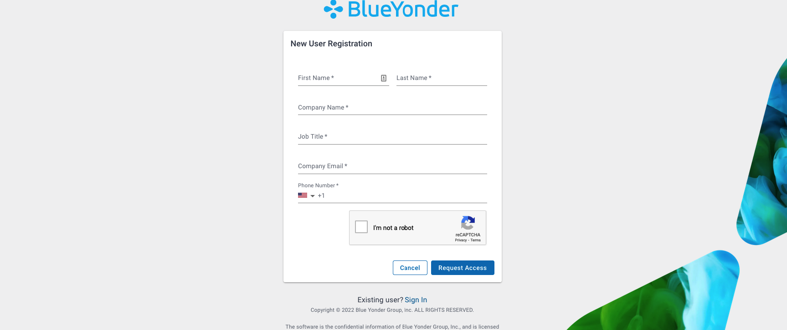

# Welcome to DevCon

## Workshop: Platform at Your Fingertips

### Registration

!!! note
    If you want to participate in the workshop, you need an account first.
    Please create your account well in advance as your request needs to be checked. 

[You can request your account here :fontawesome-solid-paper-plane:](https://bylumuiportalplpna.azureedge.net/?access_domain=7dbea5bb-28b5-4059-bf2a-5b5bf6dae107){ .md-button }

<figure markdown>
  {: align=left }
  <figcaption>Click on 'Register Here'</figcaption>
</figure>

<figure markdown>
  {: align=left }
  <figcaption>Make sure you fill out all the required fields</figcaption>
</figure>

Make sure you fill out all the required fields and make sure it is a valid phone number (you can check [here](https://libphonenumber.appspot.com/) ). Also make sure to use your company email address. 
Otherwise the approval might fail.
If you do not receive an email within 24h (manual approval required), please contact Sebastian.Neubauer@[Blue Yonder domain]

Once you received an email with a temporary password.

You can now login here (and change your password on your first login):

[https://bylumuiportalplpna.azureedge.net/home/](https://bylumuiportalplpna.azureedge.net/home/)

You need to enter the realm, which is `by-developer` for the developer portal.

That's it, you should now be onboarded to the Luminate Platform!

!!! note "Prepwork for the workshop"
    - Create your account
    - All you need is a Browser (use Firefox or Chrome) and internet