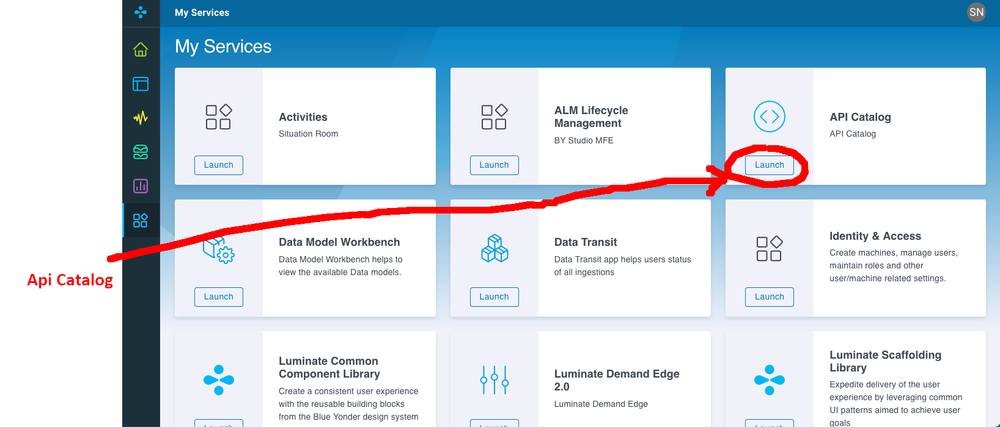

# The developer Portal

## Login
First we login into the developer portal:

[https://bylumuiportalplpna.azureedge.net/home/](https://bylumuiportalplpna.azureedge.net/home/){:target="_blank"}

You need to enter the realm, which is `by-developer` for the developer portal.

Then login with your account credentials.

## Navigate the portal

<figure markdown>
  {: align=left }
  <figcaption>After login you see the dashboard</figcaption>
</figure>

For now we are only interested in the "App Gallery" whoch shows all services and application that you have access to.

<figure markdown>
  {: align=left }
  <figcaption>The App Gallery view</figcaption>
</figure>

## The API Catalog

We now want to find out if there are APIs we can use to build our notification feature.
For this we launch the API Catalog in the API Gallery

<figure markdown>
  {: align=left }
  <figcaption>Launch the API Catalog</figcaption>
</figure>

Inside the API Catalog, search for LDE. You then will find all the API exposed by LDE for you.
You should find the "Blue Yonder LDE Prediction Overrides v1" API and click on it.

<figure markdown>
  {: align=left }
  <figcaption>Finding the LDE Prediction Overrides API in the API Catalog</figcaption>
</figure>

Once you clicked on it, you will be navigated to the API documentation.

<figure markdown>
  {: align=left }
  <figcaption>Documentation of the LDE Prediction Overrides API</figcaption>
</figure>

Here you can try our an API call by first clicking on the "Try it out" button
and subsequently on the "Execute" button.


<figure markdown>
  {: align=left }
  <figcaption>You can try the API by clicking on "Execute"</figcaption>
</figure>

By exectuing this GET request we will get a list of all prediction overrides stored in the LDE instance.

<figure markdown>
  {: align=left }
  <figcaption>Hey, we have a list of all prediction overrides stored in the LDE instance!</figcaption>
</figure>

The response should look like this

``` json hl_lines="10"
[
  {
    "processing_status": "FINISHED",
    "override_id": "6caccdf4-eeef-4fb7-83b6-6e96b334719b",
    "override_type": "create",
    "mode": "workbench",
    "product_column_name": null,
    "location_column_name": null,
    "value_column_name": null,
    "creation_time": "2022-04-25T22:17:22.563620+00:00",
    "is_active": true,
    "desired_is_active": true,
    "last_update": "2022-04-25T22:17:30.766706+00:00",
    "creation_user": "someone@youdelivers.com",
    "last_updated_user": "someone@youdelivers.com",
    "reason": "other",
    "description": "",
    "min_affected_date": "2022-04-28",
    "max_affected_date": "2022-05-17",
    "number_clp_combination": 273,
    "number_rows": null,
    "source": "lde-ui",
    "prediction_accuracy": null,
    "override_accuracy": null
  },
...
]
```

For our purpose, we are only interested in the `creation_time` value. But just 
look what's there, endless possibilities for cool new features, right?


## Create LIAM m2m client

Luminate Identy Access Management (LIAM) is the authentication and authorization 
service in the Luminate Platform. 

You are already logged in into the portal, so your identity is known to all services.
But when we want to build a service accessing API's, it is not you accessing the APIs, but this service.

This is what machine-to-machine clients (m2m client) are for in LIAM. So we can create new identities that we
assign to services and give it any subset of roles and permissions that our own identy has.

This is increasing security dramatically, as we can shape those permissions such that it is "just enough" to do the job.
Through the "scope" we can limit which services can be accessed, so that even if this m2m client is leaked, it
cannot be used for anything else that the anticipated use-case.

We can create m2m clients in a self service in the Identity & Access application available in the app gallery.

<figure markdown>
  {: align=left }
  <figcaption>Access the Identity & Access application</figcaption>
</figure>

In the Identiy & Access application change to the "Machines" tab and with the "+" icon we can create a new m2m client 
for our workflow.

<figure markdown>
  {: align=left }
  <figcaption>Create a new m2m client using the "+" icon in the "Machines" tab</figcaption>
</figure>

In the pop-up give the m2m client a good name (that's hard, I know). As this is a shared environment, probably it is a 
good idea to append your name, so why not `devcon-workshop-<yourname>`.

<figure markdown>
  {: align=left }
  <figcaption>Note the Client ID and add a secret</figcaption>
</figure>

!!! note
    Don't forget to note the client secret and store it somewhere safe!
    (A password manager would be a good option)

<figure markdown>
  {: align=left }
  <figcaption>Copy the secret and store it somehwere safe</figcaption>
</figure>

Now we need to add the role to be able to access the LDE oeverrides API.
This role is called `lde-full-access`, just start to type and select in the picker.


<figure markdown>
  {: align=left }
  <figcaption>Add the `lde.full-access` role</figcaption>
</figure>

That's it, we created a m2m client. Easy, right?

## Building the Workflow

Now we now there is an API, we have a m2m client to be able to access this API.
Now we need something to actually call the API and trigger actions based on the results.
That is exactly what the "Workflow" feature is for. 

<figure markdown>
  {: align=left }
  <figcaption>Start the ALM application in the app gallery</figcaption>
</figure>